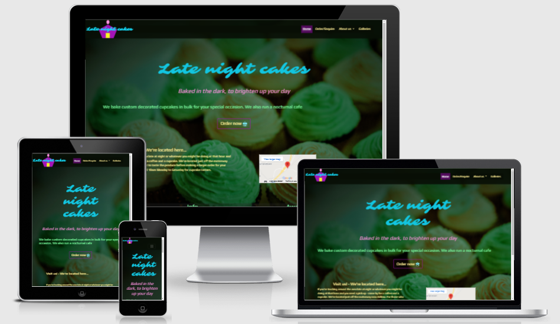

# **Late night cakes Website**
[View the live project here](https://j-j-jack.github.io/MS1-project-resubmission/)  
This is the documentation of the Late night cakes website. Late night cakes is a fictional company that operates during the night baking bulk orders for custom made cupcakes. The company also runs an all night cafe for those on the road late at night. The primary goals of the website are to allow users to order cupcakes,increasing public awareness of the brand and showcasing the company's previous work.
## **Table of Contents**
*  **[Technologies Used](#technologies-used)**
    * [Code](#code)
    * [Languages](#languages)
    * [Frameworks and Libraries](#frameworks-and-libraries)
    * [Validators](#validators)
    * [Other Technologies Used](#other-technologies-used)
*  **[UX Design](#ux-design)**
    * [Strategy Plane](#strategy-plane)
        * [Value Provided to the Business](#value-provided-to-the-business)
        * [Value Provided to the Users](#value-provided-to-the-users)
        * [B2C Considerations](#b2c-considerations)
        * [Business Objectives](#business-objectives)
        * [User Needs](#user-needs)
        * [Opportunities Table](#opportunities-table)
    * [Scope Plane](#scope-plane)
        * [Site Features](#site-features)
        * [User Stories](#user-stories)
    * [Structure Plane](#structure-plane)
        * [Interaction Design](#interaction-design)
        * [Information Architecture](#information-architecture)
    * [Skeleton Plane](#skeleton-plane)
        * [Project Wireframes](#project-wireframes)
    * [Surface Plane](#surface-plane)
        * [Colour](#colour)
        * [Layout](#layout)
        * [Fonts](#fonts)
        * [Images](#images)
        * [Order and Sequence](#order-and-sequence)
        * [Identity](#identity)
*  **[Testing](#testing)**
    * [Code Validation](#code-validation)    
    * [Feature Testing](#feature-testing)
        * [Common Features Testing](#common-features-testing)
        * [Home Page Testing](#home-page-testing)
        * [About Pages Testing](#about-pages-testing)
        * [Order Page Testing](#order-page-testing)
        * [Gallery Page Testing](#gallery-page-testing)
    * [User Story Testing](#user-story-testing)
        * [User Story 1](#user-story-1)
        * [User Story 2](#user-story-2)
        * [User Story 3](#user-story-3)
        * [User Story 4](#user-story-4)
        * [User Story 5](#user-story-5)
        * [User Story 6](#user-story-6)
        * [User Story 7](#user-story-7)
        * [User Story 8](#user-story-8)
        * [User Story 9](#user-story-9)
        * [User Story 10](#user-story-10)
    * [Image Testing](#image-testing)
    * [Responsivity Testing](#responsivity-testing)
    * [Performance Testing](#performance-testing)
* **[Bugs and Issues](#bugs-and-issues)**
    * [Known Issues](#known-issues)
    * [Bugs Encountered and Fixes](#bugs-encountered-and-fixes)
        * [Bug 1](#bug-1)
        * [Bug 2](#bug-2)
        * [Bug 3](#bug-3)
        * [Bug 4](#bug-4)
    * [Unresolved Bugs](#unresolved-bugs)
        * [Unresolved Bug 1](#unresolved-bug-1)
* **[Future Features](#future-features)**
    * [Search Bar](#search-bar)
    * [Blog Page](#blog-page)
    * [Review Page](#review-page)
    * [Sticky Navbar](#sticky-navbar)
* **[Deployment](#deployment)**
    * [GitHub Pages](#github-pages)
    * [Forking the GitHub Repository](#forking-the-github-repository)
    * [Making a Local Clone](#making-a-local-clone)
* **[References](#references)**
* **[Credits](#credits)**
* **[Acknowledgements](#acknowledgements)**

## Technologies used

### **Code**

* VSCode - to write the code for the project
* Git - used for version control 
* GitHub - software used to store project remotely
* GitHub Pages - used to deploy the project to an active link

### **Languages**

* HTML
* CSS

### **Frameworks and Libraries**

* Bootstrap
* Iconify.design [link](https://iconify.design/)
* Font Awesome [link](https://fontawesome.com/)
* JQuery
* Google Fonts

### **Validators**
 * [W3C Markup Validation Service](https://validator.w3.org/) 
 * [W3C CSS Markup Validation Service](http://jigsaw.w3.org/css-validator/validator) 

 ### **Other Technologies Used**

 * [Balsamiq](https://balsamiq.com/) - for creating wireframes
 * Chrome developer tools - for testing and inspecting code
 * Lighthouse - for testing performance rating of deployed site
 * [Boxy SVG Editor](https://boxy-svg.com) - for creating brand logo
 * [GIMP](https://www.gimp.org/) - for resizing images
 * responsivedesignchecker.com - for testing site responsivity

[back to contents](#table-of-contents)

## **UX Design**

### **Strategy plane**

The strategy upon which the site is built is based on the business objectives and the user needs.

#### **Value Provided to the Business**

The site as it is currently built provides value to the business in several ways. It allows them to develop brand awareness with the public. It allows them to interact with the public. It allows them to increase the number of people both talking about as well as visiting the cafe. Finally it allows them to receive order queries. It allows the company to showcase its previous work to the user. It is worth noting that all of the above should help the business to increase its profit margin.

#### **Value Provided to the Users**

The site as it is currently built provides value to customers in several ways that are detailed below. The site allows the users to interact with the business; regarding both ordering cakes as well as making general enquiries. The site allows customers to view information about the cafe such as its location, phone number and opening hours. It allows the user to learn about the business and to view its previous work. This should help the user to decide whether or not they wish to order from the company.

#### **B2C Considerations**

As the site will operate under the B2C model of business. There are certain considerations to be made to follow this model. Branding is very important and the branding is using the site to create a strong brand image. The brand wishes to present its brand as quirky and original by blending a nightclub aesthetic with baking. There are few steps to take for the user to make to 'purchase' the cakes. (ie. to make an enquiry about ordering cakes). There is also a flashing cake inside the order button to draw the users attention to this element straight away. Images on the site are large and vibrant. There was also an effort made to keep page content at a minimum where possible. These elements combine contribute to the site user having a positive experience while using the site. This in turn triggers positive emotions from the user towards the company. This is crucial as if the user has a negative experience while using the site they are unlikely to make a purchase from the company or visit the site again in the future. Another important consideration is that prices must be provided upfront as this this will support impulse buys.

#### **Business Objectives**

The business objectives set out by the company at the start of the project were as follows:

* To allow online orders to increase revenue
* To move the company's wordpress blog to their own website
* To increase the number of customers in the cafe
* To improve the company's public profile
* To have a collection of reviews
* to improve public knowledge of the service and the company's history

#### **User Needs**

The user needs that were defined at the start of the project were as follows:

* To be able to interact with the organisation
* To understand reasons why to choose the company
* To be able to order from the company online
* To provide feeback on goods services
* To view prices

Using the business goals and user needs a table of opportunities was created and their importance was compared with their viability to decide which opportunities to pursue.

#### **Opportunities Table**

| Opportunities                                                                                                  | Importance | Viability | in/out |
|----------------------------------------------------------------------------------------------------------------|------------|-----------|--------|
| Create a forum for reviews                                                                                     | 5          | 1         | out    |
| Supply information about the company history and services (feeds into reasons to choose the company for users) | 4          | 4         | in     |
| Increase traffic to cafe (develop a strategy to do this)                                                       | 4          | 1         | out    |
| Move blog to own website                                                                                       | 3          | 1         | out    |
| Provide a means for the public/other businesses to interact with company                                       | 3          | 5         | in     |
| Provide a means for user's to view company's previous work                                                     | 4          | 4         | in     |
| Allow customers to order online                                                                                | 5          | 5         | in     |
| Provide information about the cafe's opening hours and address                                                 | 4          | 5         | in     |

[back to contents](#table-of-contents)

### **Scope Plane**

#### **Site Features**

The features to be included in the site based on the tradeoffs from the strategy plane. They are as follows:

A form page - A form page will be developed to allow customers/other businesses to interact with the company. This form will also double up as an order form which customers will fill out information about what they want to buy and leave their email so that the company can follow up.

About pages - This will help the company provide the public with information about their history and services and will also give reasons to customers to choose the company. 

Social media links - This will allow potential customers to view the companys previous workand give them reasons to choose the company. Also the company's blog will be linked. This somewhat amends the fact that the blog will not be transferred to view on the site directly.

Gallery - Again so that potential customers can view previous work. This will give them reasons to choose the company.

Cafe-info - A google map, the cafe phone number and the opening hours - while this is not a strategy to increase numbers to the cafe, it may do so indirectly.

#### **User Stories**

User stories were created to aid in the designing of the site and in testing later on. They are as follows:

* As somebody interested in buying cupcakes, I expect to discover when the cafe is open to sample cupcakes.
* As a lorry driver in the area I expect to find the location of the cafe.
* As a person who wants to buy cupcakes I expect to be able make an order.
* As a unsure potential customer I expect to view the company's previous work before deciding whether or not to choose the company.
* As a local politician I expect to contact the company in relation to employment schemes.
* As a potential bulk buyer I want to see a list of prices.
* As a socially concerned citizen I expect to learn about where the company gets their ingredients.
* As a regular visiter to the cafe I want to view the company's social media pages.
* As a soon to be married bride I expect to learn whether the company has received awards for its work before making a large order for the wedding reception.
* As a local journalist I want to expect about the history of the business before reaching out for an interview with the company owner.

[back to contents](#table-of-contents)

### **Structure Plane** 

#### **Interaction Design**

1. Consistency - The site should remain consitant across all pages. This includes the following.
    * The navbar will remain at the top of the page and the footer at the bottom. 
    * There will be a burger icon on all pages instead of a nav-bar on smaller screen sizes. 
    * Styling will also remain consitant across all pages.
2. Predictablity -
    * All links will take the user to expected locations.
    * Social media links will open in new tabs as this is what users expect.
    * Clicking on the logo will take the user back to the home page as is convention. 
3. Learnability -
    * There will be active links on the navbar so that the user will know what page they are on. 
    * Pages with the same function will have the same layout to provide the user with a better sense of place and navigational possibilities. 
4. Visibility -
    * When possible as much page content for each page will be visible on each page. 
    * In situations where the content exceeds that of the screen size content hinting will be used. 
5. Feedback - There will be clear and consistant feedback given to site users -
    * Buttons that link the user to other locations will highlight when the mouse is over them.
    * For links and other clickable items the cursor will change to a pointer. 

#### **Information Architecture**

The site operates using a traditional navigational system with a navbar at the top of the page. This is complimented by having an order now button in the centre of the home page and on the 'Why choose us?' page. The button is on the home page to minimise the number of steps and effort the user needs to make in reaching the order form. The button is placed on the 'Why choose us?' page as this is the end of a sale pitch so to speak. It makes sense to give the user the opportunity to navigate to the the order page at this point. There are also arrow navigation buttons present between the about pages as these pages are meant to be grouped. These navigational features combine to create an efficient yet effective system of navigation.

[back to contents](#table-of-contents)

### **Skeleton Plane**

The site uses icons as metaphors. Examples of these include the left and right arrows as well as the house representing the home page in the about pages. There are also social media icons used in the footer on all pages. Content on the site will be well spaced and will be easy to read with good colour contrast. This is good information design.

#### **Project Wireframes**

[about us pages on mobile](assets/wireframes/about-us-pages-cupcakes-mobile.png)  
[about us pages on tablet](assets/wireframes/about-us-pages-cupcakes-tablet.png)  
[about us pages on laptop](assets/wireframes/about-us-pages-cupcakes-laptop.png)  
[about us pages on desktop](assets/wireframes/about-us-pages-cupcakes-desktop.png)  
[form page on mobile](assets/wireframes/form-page-cupcakes-mobile.png)  
[form page on tablet](assets/wireframes/form-page-cupcakes-tablet.png)  
[form page on laptop](assets/wireframes/form-page-cupcakes-laptop.png)  
[form page on desktop](assets/wireframes/form-page-cupcakes-desktop.png)  
[galleries page on mobile](assets/wireframes/galleries-page-cupcakes-mobile.png)  
[galleries page on tablet](assets/wireframes/galleries-page-cupcakes-tablet.png)  
[galleries page on laptop](assets/wireframes/galleries-page-cupcakes-laptop.png)  
[galleries page on desktop](assets/wireframes/galleries-page-cupcakes-desktop.png)  
[home page on mobile](assets/wireframes/home-page-cupcakes-mobile.png)  
[home page on tablet](assets/wireframes/home-page-cupcakes-tablet.png)  
[home page on laptop](assets/wireframes/home-page-cupcakes-laptop.png)  
[home page on desktop](assets/wireframes/home-page-cupcakes-desktop.png)  

[back to contents](#table-of-contents)

### **Surface Plane**

 

Below are the surface plane considerations that were made for the site
  

#### **Colour**

 The colous chosen for the site are based on the colors seen on neon outdoor signs for nightclubs.  

#### **Layout**

The site uses attempts to create elements from the same sections aligned linearly to help in defining where sections begin and end for the user. The site uses changes of color in the navbar and footer to define sections.   

#### **Fonts**

The fonts chosen for the site are the fonts 'Sarina' and 'Play'. These are nights seen on nightclub banners outdoors.    

#### **Images**

The icons used on the site will be chosen according to how recognisable they are. The background image is a docotored image of cupcakes so they appear to be under neon lights. This keeps in line with the site's aesthetic.   

#### **Order and Sequence**

The most important elements on the site are the most easily recognized. An example of this would be the order now button on the home page. The flashing cake icon draws the users attention to the button. It is the company's main priority to be able to receive orders so it is important that this element is recognisable.   

#### **Identity**

The surface plane decisions in this site combine to create a quirky brand image. This is due to the unusual pairing between the nightclub aesthetic (that is pursued through elements like the fonts, colours and background image) and the company that the site is built for (a bakery).   

---

[back to contents](#table-of-contents)

## **Testing**

### **Code Validation**

* The HTML in this project was validated using the W3C code validation service. [W3C Markup Validation Service](https://validator.w3.org/) 

 * The CSS in this project was validated using the W3C CSS Code Validation Service [W3C CSS Markup Validation Service](http://jigsaw.w3.org/css-validator/validator) 

[back to contents](#table-of-contents)

### **Feature Testing**

#### **Common Features Testing**
**Navbar**  
Navbar links (small and large screen):  
Expected: The links should navigate the user to the pages that they describe. They should change colour when they are hovered over. The current page the user is on should be highlighted. The 'About us' link should open a dropdown for the individual about pages when hovered clicked. 
Test result: All the links take the user to the right pages when clicked. The pages darken slightly when hovered over. The current page is highlighted with a dark purple color. The 'About us' link releases a dropdown for the individual about pages when clicked.  
Analysis: The feature functions as expected.  

---

Burger icon (smaller screens):  
Expected: The navbar links should collapse on smaller screens and a burger icons should appear. When clicked the burger icon should release a dropdown that contains the navbar links.
Test Result: The links disappear on smaller screens. A burger icon appears on the right. When clicked the burger icon releases a dropdown which contains the navbar links.  
Analysis: The feature functions as expected.

---

Navbar logo:  
Expected: The navbar should take the user back to the home page when it is clicked from all pages. 
Test results: The navbar navigates the user back to the home page from all pages. <bn>
Analysis: The feature functions as expected

---

**Footer:**  
Social links:  
Expected: The social links should open in a new tab. The cursor should change to a pointer when the links are hovered over.  
Test result: When hovered over the cursor changes to a pointer. When clicked the links open in a new tab. 
Analyis: The feature functions as expected.  

---

Cafe information:  
Expected: The section should display the cafe phone number, address, opening hours and the hours for tasting cupcakes.  
Test result: The section shows all of the above.  
Analysis: The feature functions as expected.  

---

Award information:  
Expected: The section should display the awards that the cafe has won  
Test result: The section shows the cafe's awards.  
Analysis: The feature functions as expected.  

---

[back to contents](#table-of-contents)

#### **Home Page Testing**
Home page banner:  
Expected: The banner should display the company name using the logo font, the company slogan and a brief synopsis of what the company does.  
Test results: The banner displays all of the above.
Analysis: The feature functions as expected.

---

Home page order button:  
Expected: The order button should navigate the user to the order page. When hovered over it should highlight. It should display a flashing cake icon to attract the users attention.  
Test results: The button takes the user to the order page when clicked. When hovered over it highlights in a purple colour. The flashing cake icon is displayed. 
Analysis: The feature functions as expected.  

---

Home page map section:  
Expected: The section should display a google map with a marker showing the company's location. A paragraph should be displayed describing the company's opening hours and location.  
Test results: The section displays all of the above. 
Analysis: The feature functions as expected. 

---

[back to contents](#table-of-contents)

#### **About Pages Testing**

About pages paragraph:  
Expected: The pages should display a paragraph of text that matches the title of the individual page. The 'Who are we?' page paragraph should display a paragraph describing the company owner and the founding of the company. The 'What do we do?' page paragraph should describe the operation of the company. The 'Why choose us page' paragraph should describe reasons to purchase from the company. 
Test results: All pages' paragraphs display the information as required as described about. 
Analysis : The feature functions as expected. 

---

About pages images:  
Expected: Each individual page should contain an image which compliments the paragraph present on the page. 
Test results: All pages contain an image as described above.  
Analysis: The feature functions as expected.  

---

About pages navigation buttons : 
Expected: The navigation buttons should navigate the user forward in the following way: From the 'who are we page?' to the 'What do we do page'. From the 'What do we do?' page to the 'Why choose us?' page. From the 'Why choose us page?' back to the home page. It should also be possible for the user to navigate through the pages in the opposite direction. The buttons should highlight when hovered over. 
Test results: The buttons navigate the user as described above when clicked. When the user hovers the mosue over the buttons the buttons highlight in a purple colour. 
Analysis: The feature functions as expected.  

---

'Why choose us' page order button:  
Expected: The order button should navigate the user to the order page. When hovered over it should highlight. It should display a flashing cake icon to attract the users attention.  
Test results: The button takes the user to the order page when clicked. When hovered over it highlights in a purple colour. The flashing cake icon is displayed. 
Analysis: The feature functions as expected.  

---

[back to contents](#table-of-contents)

#### **Order Page Testing**

Price information section  
Expected: The section should contain pricing information for the cupcakes for the following. <50, 50-99, 100-199, 200-399 and 400+.   
Test results: The section displays the pricing information that is described above  
Analysis: The feature functions as expected.  

---

Order/general enquiry form  
Expected: The form elements should be clickable and it should be possible for the user to fill in the form. The form should not be possible to submit unless all fields are filled out apart from the phone number. The button should highlight when hovered over. The form should submit when all the required fields are filled out. 
Test results: The form elements can be filled out when they are clicked on. The form does not submit when the required fields are not filled out. The user is notified to fill in the first required field in the form which they have not completed until the full form is filled out. The button highlights in a purple colour when the mouse hovers over it. The form submits when the user clicks the submit button and all the required fields are filled out. 
Analysis: The feature functions as expected.  

---

[back to contents](#table-of-contents)

#### **Gallery Page Testing**

Thumbnails  
Expected: When each individual thumbnail is clicked a modal should open. The modal should contain a carousel of images. When hovered over the thumbnails should darken slightly and the cursor should changed to a pointer. 
Test results: Clicking on each thumbnail opens a a modal. Each modal contains a carousel of images. When the user hovers the cursor over the thumbnail the image darkens slightly and the cursor changes to a pointer. 
Analysis: The feature functions as expected.  

---

Modal carousels  
Expected: The modals should open fullscreen. It should be possible for the user to click the left and right arrows in the modal to navigate from one image to the next or previous image. The X icon in the top right of the modal should close the modal. 
Test results: The modal opens fullscreen. Clicking the right arrow navigates the user to the next image. Clicking the left image navigates the user to the previous image. Clicking the X icon closes the modal.  
Analysis: The feature functions as expected.  

---

[back to contents](#table-of-contents)

### **User Story Testing**

#### **User Story 1**

Expectation: As a person who wants to buy cupcakes I expect to be able make an order. 
Test result: On entering the site the user clearly sees the order button on the home page. This is due to its large size and central location on the page but also due to the flashing cake icon. The user clicks this button and are directed to the order page where they place an order. On the order page the user fills out the form giving their name, email clicking the order radio button and writing information about their order. The user then clicks submit. 
Analysis: The user's expectation has been met 

[screenshot of user story](assets/user-story-testing-images/user-story-1.PNG)

---

#### **User Story 2**

Expectation: As a lorry driver in the area I expect to find the location of the cafe.  
Test result: on entering the site the map is clearly visible due to content hinting. The lorry driver scrolls down to the map and finds the location. 
Analysis: The user did not experience problems in The user's expectation has been met.  

[screenshot of user story](assets/user-story-testing-images/user-story-2.PNG)

---

#### **User Story 3**

Expectation: As somebody interested in buying cupcakes, I expect to discover when the cafe is open to sample cupcakes. 
Test result: On entering the site the user searches visually for when the cafe is open. The user does not locate the opening hours. The user then scrolls to the footer. It is conventional to find such information in the footer. The user finds the opening hours in the footer  
Analysis: The user easily found the opening hours. However, perhaps it is worth adding the opening hours near the top of the home page in a future build.  

[screenshot of user story](assets/user-story-testing-images/user-story-3.PNG)

---

#### **User Story 4**

Expectation: As a unsure potential customer I expect to view the company's previous work before deciding whether or not to choose the company.  
Test result: On entering the site the user clicks on the gallery link in the navbar. The user is taken to the galleries page. The user hovers over the thumbnail for the gallery. The cursor changes to a pointer and the image darkens encouraging the user to click on the thumbnail. The user clicks on the thumbnail and opens the carousel modal. The user uses the right arrow to cycle through the images. The user clicks the X icon in the top right of the modal. The user repeats the process for the remaining thumbnails. 
Analysis: The user's expectation was met without issues.  

[screenshot of user story](assets/user-story-testing-images/user-story-4.PNG)

---

#### **User Story 5**

Expectation: As a local politician I expect to contact the company in relation to employment schemes.  
Test result: on entering the site the user searches the screen for options. The user sees the 'Order/Enquire' link in the navbar. The user clicks is taken to the order/enquiry form page. The user fills out the form selecting the general enquiry option. The user clicks the submit button. 
Analysis: The user's expectation was met without expectation. 

[screenshot of user story](assets/user-story-testing-images/user-story-5.PNG)

---

#### **User Story 6**

Expectation: As a potential bulk buyer I want to see a list of prices.  
Test result: On entering the site the user checks the navbar for a link to pricing. They do not see one. The user searches the home page for prices. They do not find any. They look at the navbar again and assume that they can find prices on the order page. The user opens the order page and sees the prices. 
Analysis: Although the user's expextation was met successfull. There needs to be a slight change in design so that it is more intuitive for the user to find the prices. 

[screenshot of user story](assets/user-story-testing-images/user-story-6.PNG)

---

#### **User Story 7**

Expectation: As a socially concerned citizen I expect to learn about where the company gets their ingredients.  
Test result: On entering the site the user. Clicks the about us link in the navbar, releasing the dropdown. It is not obvious on which page the user should click. The user clicks the first link - 'Who are we?'. The user navigates to this page. The user does not find the information they require. The user clicks the next button and is taken to the 'What do we do?' page. Again, the user does not find the information they require and clicks the next button. The user is taken to the 'Why choose us page?'. The user reads the paragraph on this page and finds the information they are searching for.  
Analysis: Although the user's expectation was met successfully, perhaps in a future build there should be a way for the user to search for specific information.  

[screenshot of user story](assets/user-story-testing-images/user-story-7.PNG)

---

#### **User Story 8**

Expectation: As a regular visiter to the cafe I want to view the company's social media pages.  
Test result: On entering the site the user searches visually for social media icons. The user does not see any. The user immediately scrolls to the footer as it is conventional to find social media links in the footer. The user clicks on the social media links in the footer and navigates to the companys' social media pages.  
Analysis: The user's expectation was met without issue.  

[screenshot of user story](assets/user-story-testing-images/user-story-8.PNG)

---

#### **User Story 9**

Expectation: As a soon to be married bride I expect to learn whether the company has received awards for its work before making a large order for the wedding reception.  
Test result: On entering the site the user searches for information about the awards. The user is unsure where to look. The user checks the footer as they have seen this kind of information located there in other sites. The user finds the informatino they are searching for.  
Analysis: Although it was somewhat intuitive for the user to check the footer for information about the awards, it is not guaranteed that all users would do this. In a future build it should be possible for the user to use a search bar to search for this information.  

[screenshot of user story](assets/user-story-testing-images/user-story-9.PNG)

---

#### **User Story 10**

Expectation: As a local journalist I want to expect about the history of the business before reaching out for an interview with the company owner.  
Test Result: On entering the site the user clicks on the about us link in the navbar. The user clicks the 'Who are we?' link when the menu drops down. The user is taken to the page and finds the information they are searching for.  
Analysis: Unlike the user searching for information about the ingredients it was quite intuitive for the user where to look to find the information that they required. However, the developer feels that it still may be useful to have an alternative means to search for the information. 

[screenshot of user story](assets/user-story-testing-images/user-story-10.PNG)

---

[back to contents](#table-of-contents)

### **Image Testing**

The images on the site were ensured to be an appropriate size. They were resized using GIMP - [link to software website](https://www.gimp.org/). They were properly sized so they were not too small so as to appear pixelated and not too large so as to slow page loading times excessively.

[back to contents](#table-of-contents)

### **Responsivity Testing**

The site was initially tested for responsivity within Chrome developer tools. After the site's developement was finished the site was tested for it's responsivity using responsivedesignchecker.com. The site was observed to respond well on all the screen sizes available on this site.

[back to contents](#table-of-contents)

### **Performance Testing**

The site was tested for its performance and accessibility rating using lighthouse. The site scored exceptionally well in all areas except mobile performance. However it still received a reasonable score in this category. The developer should attempt to increase the mobile performance rating in future builds. Screenshots for the mobile and desktop lighthouse reports are linked below.  

[Lighthouse Mobile Report](assets/lighthouse-report-mobile.PNG) 
[Lighthouse Desktop Report](assets/lighthouse-report-desktop.PNG)

[back to contents](#table-of-contents)

## **Bugs and Issues**

### **Known Issues**

There are some minor issues with the site's usability found while testing the user stories. It could be made easier to search the site for specific information such as ingredients, opening hours, awards won by the company, prices and other information about the company. The developer also notes that it would increase usability if the opening hours and a link to the prices were visible when the home page is loaded. Another issue is the mobile performance. Although it was quite good, there is still room for improvement and steps can be taken to improve this in the future.

[back to contents](#table-of-contents)

### **Bugs Encountered and Fixes**

#### **Bug 1**
Bug: Misalignment of radio buttons and problem with validation on form page. The radio buttons were not aligned on the form page and when clicking submit the general enquiry option was not validating. 
Fix: This was an issue regarding the name attribute on the buttons not matching. The developer fixed this simply by making sure that both buttons contained the same name attribute. Once this was changed the buttons were properly grouped together and aligned correctly. It also fixed the problem with the validation. 

[Screenshot of bug](assets/bugs/bug-1.PNG)

---

#### **Bug 2**
Bug: Unnecessary horizontal scroll on smaller devices. There was space to the right of all the content on smaller devices. 
Fix: The developer searched for the cause of the unnecessary horizontal scroll but could not determine the exact cause. It was however fixed easily by changind the overflow-x property of the body to hidden in the CSS file. 

[Screenshot of bug](assets/bugs/bug-2.PNG)

---

#### **Bug 3**
Bug: Changing of colour in the modal background and tab indicator. When the developer changed the active pages links in the navbar to be highlighted this issue appeared. 
Fix: This issue was due to the bootstrap framework using the active class both for the navbar and the carousel components. The developer fixed this by resetting the color of the active class when it is a child of the carousel classes. 

[Screenshot of bug](assets/bugs/bug-3.PNG)

---

#### **Bug 4**
Bug: logo covering the burger icon. As the screen size decreases more and more of the icon is covered by the company logo.  
Fix: This was fixed simply by adding a max-width property to the image in the CSS file. 

[Screenshot of bug](assets/bugs/bug-4.PNG)

---

[back to contents](#table-of-contents)

### **Unresolved Bugs**

#### **Unresolved Bug 1**

Bug: The navbar did not respond to the sticky position property in the CSS file.
Attempted fix: The developer attempted to place a div with a fixed height above the navbar. Then to set the position of the parent div to sticky with a top property of 0px. However the result was not as the developer expected. The developer spent time trying to find a solution to no avail. The bootstrap classes interfere with the normal functioning of the sticky property. Due to time constraints the developer decided to create a workaround in place of a sticky navbar.
Workaround: The developer decided to decrease the size of the navbar to a minimum so as not to take up much space on the screen. 
[Screenshot of workaround](assets/bugs/bug-5.PNG)

[back to contents](#table-of-contents)

## **Future Features**

### **Search bar**
This would greatly help resolve the issues regarding the difficulty of finding specific information on the site. 

### **Blog Page**

As this was left out of the scope for the current build. It should be noted as a desirable future feature. The developer should find a means to transfer the company's wordpress blog onto the main website.

### **Review Page**
This was another feature that was left out of the scope for this build so it should be included in the next. This is an important feature as it should help potential customers with their decision whether or not to purchase from the company.

### **Sticky Navbar** 

As this bug was unresolved in the current build it should be fixed during the process of the next build. This would improve page visibility by minimising the space taken up by the navbar.

[back to contents](#table-of-contents)

## **Deployment**

### **GitHub Pages**
The project was deployed to GitHub Pages using the following steps...

1. Log in to GitHub and locate the GitHub Repository
2. At the top of the Repository (not top of page), locate the "Settings" Button on the menu.
3. Scroll down the Settings page until you locate the "GitHub Pages" Section.
4. Under "Source", click the dropdown called "None" and select "Master Branch".
5. The page will automatically refresh.
6. Scroll back down through the page to locate the now published site link in the "GitHub Pages" section.

[back to contents](#table-of-contents)

### **Forking the GitHub Repository**
By forking the GitHub Repository we make a copy of the original repository on our GitHub account to view and/or make changes without affecting the original repository by using the following steps...

1. Log in to GitHub and locate the GitHub Repository
2. At the top of the Repository (not top of page) just above the "Settings" Button on the menu, locate the "Fork" Button.
You should now have a copy of the original repository in your GitHub account.

[back to contents](#table-of-contents)

## **Making a Local Clone**
1. Log in to GitHub and locate the GitHub Repository
Under the repository name, click "Clone or download".
2. To clone the repository using HTTPS, under "Clone with HTTPS", copy the link.
3. Open Git Bash
4. Change the current working directory to the location where you want the cloned directory to be made.
Type git clone, and then paste the URL you copied in Step 3.
$ git clone https://github.com/j-j-jack/MS1-project-resubmission
Press Enter. Your local clone will be created.

$ git clone https://github.com/j-j-jack/MS1-project-resubmission
> Cloning into `late-night-cakes-Clone`...
> remote: Counting objects: 10, done.
> remote: Compressing objects: 100% (8/8), done.
> remove: Total 10 (delta 1), reused 10 (delta 1)
> Unpacking objects: 100% (10/10), done.

[back to contents](#table-of-contents)

## **References**

**Images**

The references to the images used in the project are as follows:

Photo by Rod Long on Unsplash - background  
Photo by Fred Moon on Unsplash - Richie Mulligan  
Photo by 99.films on Unsplash - cafe  
Photo by Elle Hughes on Unsplash - ingredients  

2018
Photo by Natalie Chaney on Unsplash - cupcake-1  
Photo by Daniel Klein on Unsplash - cupcake-2  
Photo by Sara Cervera on Unsplash - cupcake-3  
Photo by Heather Mount on Unsplash - cupcake-4  
Photo by Jr R on Unsplash - cupcake-5  
Photo by Nickie Joseph on Unsplash - cupcake-6  
Photo by Dessy Dimcheva on Unsplash - cupcake-7  
Photo by Olivia Herlambang-Tham on Unsplash - cupcake-8  
Photo by Deva Williamson on Unsplash - cupcake-9  
Photo by Meritt Thomas on Unsplash - cupcake-10  

2019
Photo by Angèle Kamp on Unsplash - cupcake-1  
Photo by Cristina Matos-Albers on Unsplash - cupcake-2  
Photo by Cristina Matos-Albers on Unsplash - cupcake-3  
Photo by Mia Cambriello on Unsplash - cupcake-4  
Photo by Tai's Captures on Unsplash cupcake-5  
Photo by Meritt Thomas on Unsplash - cupcake-6  
Photo by Charisse Kenion on Unsplash - cupcake-7  
Photo by Brooke Lark on Unsplash - cupcake-8  
Photo by atheer alghamdi on Unsplash - cupcake-9  
Photo by Jamie Street on Unsplash - cupcake-10  

2020
Photo by Jennie Brown on Unsplash - cupcake-1  
Photo by Léo Roza on Unsplash - cupcake-2  
Photo by Marta Muñoz on Unsplash - cupcake-3  
Photo by Jen Theodore on Unsplash - cupcake-4  
Photo by Katherine Chase on Unsplash - cupcake-5  
Photo by ABHISHEK HAJARE on Unsplash - cupcake-6  
Photo by OhTilly on Unsplash - cupcake-7  
Photo by Jacob Boavista on Unsplash - cupcake-8  
Photo by Siora Photography on Unsplash - cupcake-9  
Photo by Aneta Voborilova on Unsplash - cupcake-10  

[back to contents](#table-of-contents)

## **Credits**

- Many of the more difficult components used in this project were taken from bootstrap. These components include the navbar, the carousels, the buttons and the modals. These are documented in the bootstrap 4.5 components sections. 
[link to documentation](https://getbootstrap.com/docs/4.5/components/buttons/) 
- The deployment section of the README file was adapted directly from the code provide by the code institute.  
[link](https://github.com/Code-Institute-Solutions/SampleREADME) 
The code for making the modals fullscreen was a solution provided by andreivictor on stackoverflow.com
[link](https://stackoverflow.com/questions/18432394/how-to-make-twitter-bootstrap-modal-full-screen#:~:text=If%20you%20want%20to%20use,for%20screens%20smaller%20than%201200px%20)

[back to contents](#table-of-contents)

## **Acknowledgements**

I would like to thank my mentor Aaron for the time he invested during this project. He pointed out obvious and more delicate design flaws during the process and this was very helpful in reaching an accessible and more professional end product. I would also like to thank the team at code institute for their instruction while approaching the project.

[back to contents](#table-of-contents)